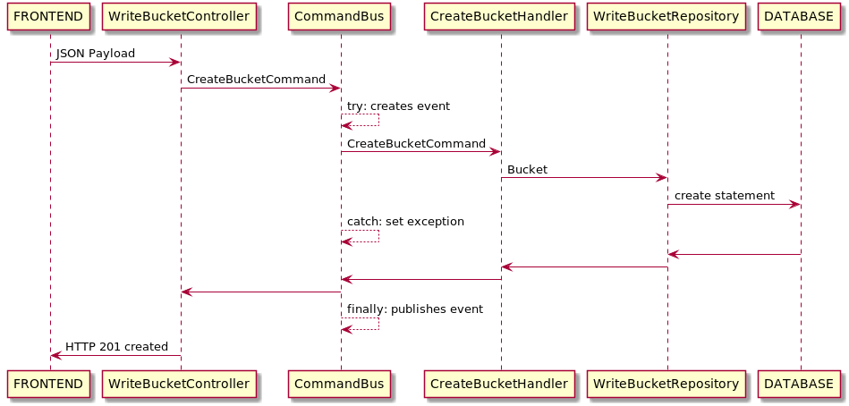
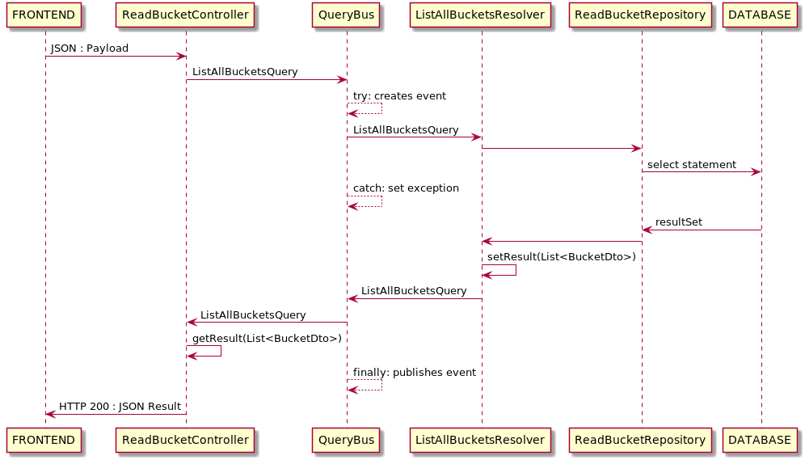

# Kanban Board Project

**Videos deste projeto**: https://www.youtube.com/user/mariorez

Versão **QUARKUS**: https://github.com/mariorez/kanban-quarkus

## Stack utilizada

- Java 14: https://sdkman.io/
- Maven: https://sdkman.io/
- Spring Boot 2.3: https://start.spring.io/
- Postgres: https://hub.docker.com/_/postgres

## Levantando a aplicação

1 - Levantar o **Banco-de-Dados POSTGRES**:
```
docker-compose up -d
```

2 - Levantar o **SPRING-BOOT**:
```
mvn spring-boot:run
```

## Documentação API

**Swagger**: http://localhost:8080/swagger-ui.html

## Frontend Web

**Home**: http://localhost:8080

## Documentos complementares






